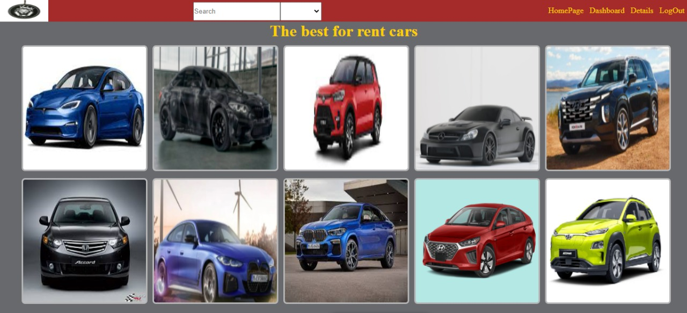
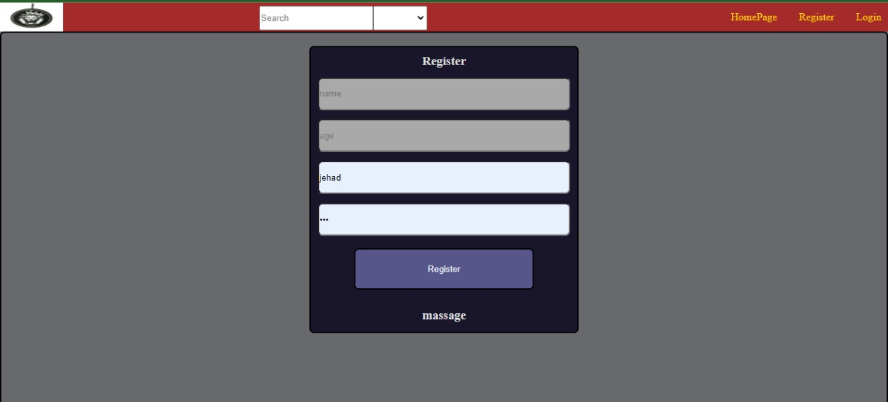
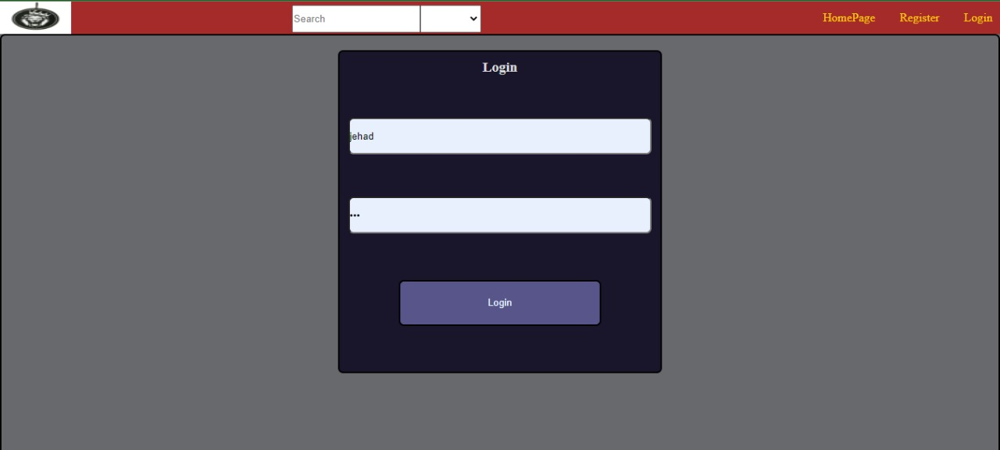
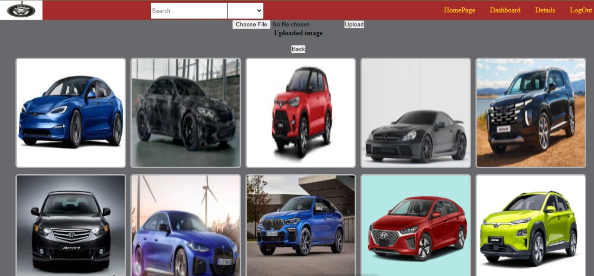
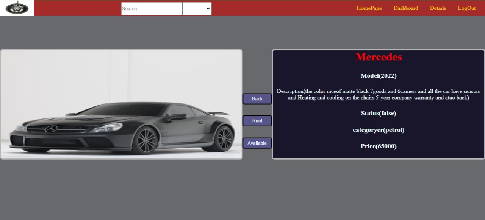
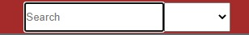
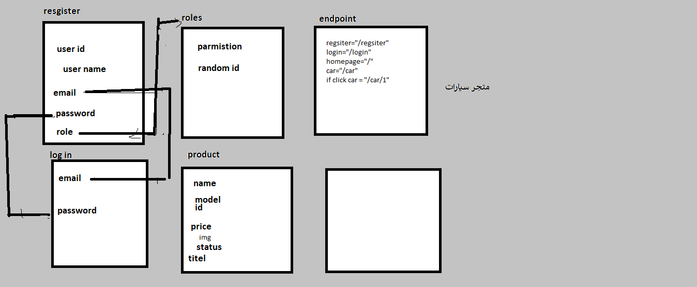

<p align="center">
  <a href="" rel="noopener">
 </a>
</p>

<h3 align="center">The best for rent cars</h3>

---

<p align="center"> Few lines describing your project.
    <br> 
</p>

## 📝 Table of Contents

- [About](#about)
- [Getting Started](#getting_started)
- [Usage](#usage)
- [Built Using](#built_using)
- [Guided By](#guided_by)

## 🧐 About <a name = "about"><p>موقع لإيجار السيارات بطريقة سهله واسعار مميزة </p></a>

Write about 1-2 paragraphs describing the purpose of your project.

## 🏁 Getting Started <a name = "getting_started"></a>

These instructions will get you a copy of the project up and running on your local machine for development and testing purposes.


### Prerequisites

What things you need to install the software and how to install them.
vscode <a>https://code.visualstudio.com/</a>
<p>طريقة التنزيل عن طريق كلمة Download for Windows </p>
  MongoDBCompass   <a>https://www.mongodb.com/products/compass</a>
  <p>طريقة التنزيل عن طريق كلمة Download Now</p>
   postman   <a>https://www.postman.com/downloads/</a>
  <p>طريقة التنزيل عن طريق كلمة windows 64-bit</p>
  git bash   <a>https://git-scm.com/download/win</a>
  <p>طريقة التنزيل عن طريق كلمة Click here to download</p>
```
Give examples
```

### Installing

A step by step series of examples that tell you how to get a development env running.
1-clone the repo to your local machine using git bash 
git clone https://githup.com/your_username_/project-name.git 

2- install packeges repeat this step in backend and forntend folder
npm i 

3- Run server using git bash inside backend folder
npm run dev 

4-Run application using git bash inside frontend folder 
npm run start 


Say what the step will be

```
Give the example
```

And repeat

```
until finished
```

End with an example of getting some data out of the system or using it for a little demo.

## 🎈 Usage <a name="usage"></a>

<p>image for see the myapp</p>
<p>all the cars model +2015</p>


<p>image for see the register</p>
<p>you need age +18 and name and email and password</p>


<p>image for see the login</p>
<p>the same email and password</p>



<p>image for see the Das</p>
<p>can add the img in the app</p>


<p>image for see the Details</p>
<p>can see the all Details for this car and can rent it in click rent the status change to false if dont need it can back click Available the status change to true </p>


<p>image for see the SearchAndDropDown</p>
<p>you can search in any car you need just can do that in one character</p>
<p>you can in DropDown  see any car you need just can do that in one categories(Hybrid,dieselوpetrolوElectricity)</p>

Add notes about how to use the system.

## ⛏️ Built Using <a name = "built_using"></a>

- [MongoDB](https://www.mongodb.com/) - Database
- [Express JS](https://expressjs.com/) - Server Framework
- [React JS](https://https://reactjs.org/) - Web Framework
- [Node JS](https://nodejs.org/en/) - Server Environment

<a>https://trello.com/b/qcQbXztq/simple-project-cars</a>

## ⚠️ Guided By <a name = "guided_by"></a>
<p>[MERAKI Academy]</p>
This project is guided by ©️ **[MERAKI Academy](https://www.meraki-academy.org)**

